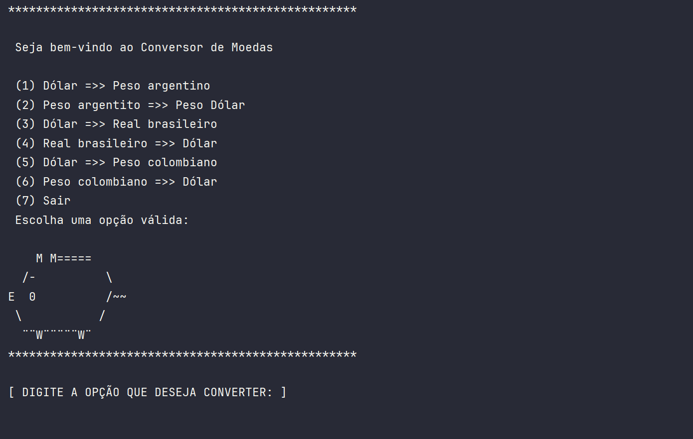

# conversor_de_moedas

Esse projeto é destinado a cumprir um desafio proposto pelo programa Oracle next education. Ele consiste na criação de
um sistema escrito na linguagem Java que tem o propósito
de fazer converções monetárias em tempo real consumindo a API [Exchange Rate API](https://www.exchangerate-api.com/)

Esse projeto oferece ao usuário uma interface textual para a interação do programa, onde se pode escolher por (6) opções
de converções monetárias. Não posso deixar de comentar sobre o porquinho investidor, ele que está de olho no mercado
financeiro rs!

